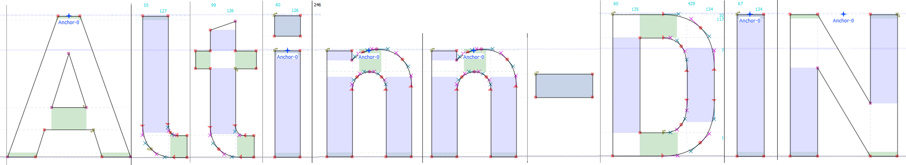

The [Altinn-DIN](https://github.com/Altinn/altinn-din) font is based on Datto [D-DIN](https://www.datto.com/fonts/d-din).
The font is made available under the [SIL Open Font License v1.1](OFL-1.1.txt).

Below is the description of the font (also contained in [FONTLOG.txt](FONTLOG.txt)).

## Basic Font Information

DIN 1451 is a [sans-serif](https://en.wikipedia.org/wiki/Sans-serif) typeface
that is widely used for traffic, administrative and technical applications.

It was defined by the German standards body DIN -
[Deutsches Institut fur Normung](https://en.wikipedia.org/wiki/Deutsches_Institut_f%C3%BCr_Normung)
(German Institute for Standardization) in the standard sheet DIN 1451-Schriften (typefaces) in
1931. Similar standards existed for stencilled letters.

Originally designed for industrial uses, the first DIN-type fonts were a
simplified design that could be applied with limited technical difficulty.
Due to the design's legibility and uncomplicated, unadorned design, it has
become popular for general purpose use in signage and display adaptations.
Many adaptations and expansions of the original design have been released
digitally.

See https://en.wikipedia.org/wiki/DIN_1451 for more information.

Datto uses a DIN-font as primary corporate font and commissioned Monotype to
create several styles, for internal use and to be open sourced under a SIL
OFL v1.1 license.

Altinn changed the reserved font names from "D-DIN" to "Altinn-DIN"
to be able to do modifications, as required by the SIL OFL v1.1 license.

Altinn-DIN currently provides the following Unicode coverage:

- Basic Latin: complete
- Latin-1 Supplement: complete
- Plus ISO 8859-15 characters missing in the above.

## Information for Contributors

This Font Software is licensed under the [SIL Open Font License, Version 1.1](OFL-1.1.txt).

[FontForge](https://github.com/fontforge/fontforge) is used for editing the Altinn-DIN sfd source files and generating fonts.

Copyright © 2019 Altinn https://github.com/Altinn/altinn-din  
Copyright © 2017 Datto Inc. https://www.datto.com/fonts/d-din

## Acknowledgements

The [Altinn-DIN](https://github.com/Altinn/altinn-din) font is based on Datto [D-DIN](https://www.datto.com/fonts/d-din).

D-DIN is based on a Monotype-font that Datto acquired to be open sourced.  
Design: Charles Nix (Monotype).

## ChangeLog

- 2019-11-20 - v2.0: Renamed D-DIN to Altinn-DIN to be able to do minor modifications.
- 2017-10-26 - v1.0: First public release